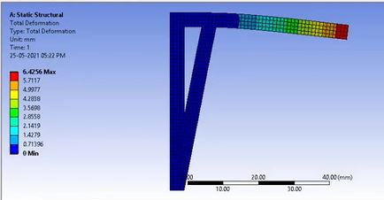
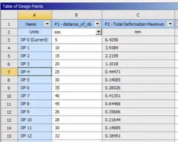

# Automated Parametric Optimization of an L-Bracket (ANSYS)

## Objective
To investigate the effect of rib placement on structural performance and identify the optimal configuration that minimizes both Total Deformation and Equivalent (von-Mises) Stress.

This study demonstrates how parametric CAE workflows enable data-driven structural design decisions.

---

## Methodology

### Geometry Parameterization
The L-bracket geometry was parameterized in ANSYS DesignModeler by defining the rib’s horizontal position (H1) as an input parameter.

### Simulation Setup
- Analysis Type: Static Structural (2D Surface Body)
- Mesh: Quadrilateral-dominant mesh
- Boundary Conditions:
  - Fixed Support applied to vertical flange
  - Downward force applied on top edge

### Parametric Study
- Input Parameter: Rib Position (H1) = 18 mm → 35 mm
- Output Parameters:
  - Equivalent Stress (MPa)
  - Total Deformation (mm)

---

## Results

### deformation

### Parametric Study Results

---

## Key Findings
- Rib placement significantly affects stiffness and stress distribution
- Moving the rib closer to the load reduces bending moment
- Stress redistribution observed with increasing rib distance
- Optimal configuration achieved by balancing deformation and stress

---

## Engineering Insight
This study highlights the importance of structural reinforcement placement.

Parametric workflows help:
- Explore multiple design configurations efficiently
- Reduce manual effort
- Enable data-driven design decisions

---

## Tools Used
- ANSYS Workbench 19.2
- DesignModeler
- Static Structural (FEA)

---

## Skills Demonstrated
- Parametric modeling
- Automated simulation workflows
- Design optimization thinking
- Structural analysis interpretation
